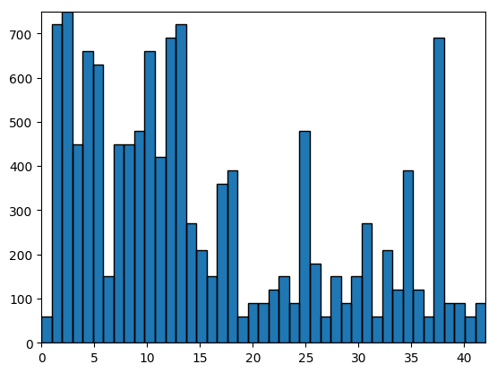

#**Traffic Sign Recognition** 

##Writeup Template

###You can use this file as a template for your writeup if you want to submit it as a markdown file, but feel free to use some other method and submit a pdf if you prefer.

---

**Build a Traffic Sign Recognition Project**

The goals / steps of this project are the following:
* Load the data set (see below for links to the project data set)
* Explore, summarize and visualize the data set
* Design, train and test a model architecture
* Use the model to make predictions on new images
* Analyze the softmax probabilities of the new images
* Summarize the results with a written report

[//]: # (Image References)

[image1]: ./examples/visualization.jpg "Visualization"
[image2]: ./examples/grayscale.jpg "Grayscaling"
[image3]: ./examples/random_noise.jpg "Random Noise"
[image4]: ./examples/placeholder.png "Traffic Sign 1"
[image5]: ./examples/placeholder.png "Traffic Sign 2"
[image6]: ./examples/placeholder.png "Traffic Sign 3"
[image7]: ./examples/placeholder.png "Traffic Sign 4"
[image8]: ./examples/placeholder.png "Traffic Sign 5"

## Rubric Points
###Here I will consider the [rubric points](https://review.udacity.com/#!/rubrics/481/view) individually and describe how I addressed each point in my implementation.  

---
###Writeup / README

####1. Provide a Writeup / README that includes all the rubric points and how you addressed each one. You can submit your writeup as markdown or pdf. You can use this template as a guide for writing the report. The submission includes the project code.

You're reading it! and here is a link to my [project code](https://github.com/pabloelizalde/CarND-Traffic-Sign-Classifier-Project/blob/master/Traffic_Sign_Classifier.ipynb)

###Data Set Summary & Exploration

####1. Provide a basic summary of the data set and identify where in your code the summary was done. In the code, the analysis should be done using python, numpy and/or pandas methods rather than hardcoding results manually.

In the first cell I load all the data, that was previously downloaded. In the second cell, a basic summary is provided:  

* The size of training set is 34799
* The size of test set is 12630
* The size of the validation set is 4410
* The shape of a traffic sign image is (32,32,3)
* The number of unique classes/labels in the data set is 43

####2. Include an exploratory visualization of the dataset and identify where the code is in your code file.

The code for this step is contained in the third and in the fourth code cell of the IPython notebook.  

In the first cell I just used a simple bar chart with number of example of each data set

In the other cell I use three histogram charts to show the amount of examples of each different label for the three data set. Doing that we can see the in the three examples, stadistically there are aproximately the same amount of example of each label in the three data sets.

###Design and Test a Model Architecture

####1. Describe how, and identify where in your code, you preprocessed the image data. What tecniques were chosen and why did you choose these techniques? Consider including images showing the output of each preprocessing technique. Pre-processing refers to techniques such as converting to grayscale, normalization, etc.

During my test I used several ways of preprocessing the images. Having diverse results. From the cells 5 to the 8, you can see the tecniques I used. These changes are applying a Gaussian blur, rotating the image, grayscale together with sharpening tecnique and using normalization. 
In the cell number 9, I apply the changes to my data set. In my final result I just used the grayscale together with the sharpening of the image, since is what gave me better results.

####2. Describe how, and identify where in your code, you set up training, validation and testing data. How much data was in each set? Explain what techniques were used to split the data into these sets. (OPTIONAL: As described in the "Stand Out Suggestions" part of the rubric, if you generated additional data for training, describe why you decided to generate additional data, how you generated the data, identify where in your code, and provide example images of the additional data)

The data downloaded was already divided in training, validation and testing. So I didn’t apply any tecnique to split the data. 
Neither I created additional data. But I was exploring possibilities for future improvements. My way to go would be apply a small rotation to the a subset of images to generate new data, and increase my testing data.

####3. Describe, and identify where in your code, what your final model architecture looks like including model type, layers, layer sizes, connectivity, etc.) Consider including a diagram and/or table describing the final model.

The code for my final model is located in the cell number 13. I started from the LeNet model. With that model I obtained a 0.82 in the validation data. After several try and error, I got the best result if I included some more convolutional layers at the beginning, making the output deeper, and adding more fully connected layers at the end. Dropout didn’t make any significant change to my model, so I did not use it. 

My final model consisted of the following layers:

| Layer         		|     Description	        					| 
|:---------------------:|:---------------------------------------------:| 
| Input         		| 32x32x1 RGB image   							| 
| Convolution 5x5     	| 1x1 stride, valid padding, outputs 28x28x6 	|
| RELU					|												|
| BATCH NORMALIZATION					|												|
| Convolution 5x5     	| 1x1 stride, valid padding, outputs 24x24x12 	|
| RELU					|												|
| Convolution 5x5     	| 1x1 stride, valid padding, outputs 20x20x24 	|
| Max pooling	      	| 2x2 stride,  outputs 10x10x24 				|
| Convolution 3x3     	| 1x1 stride, valid padding, outputs 8x8x32 	|
| RELU					|												|
| FLATTEN					|					outputs 2048							|
| Fully connected		|         outputs 512									|
| RELU					|												|
| Fully connected		|         outputs 256									|
| RELU					|												|
| Fully connected		|         outputs 84									|
| RELU					|												|
| Fully connected		|         outputs 43									|
|						|												|
|						|												|
 

####4. Describe how, and identify where in your code, you trained your model. The discussion can include the type of optimizer, the batch size, number of epochs and any hyperparameters such as learning rate.

The hyperparameter used for this model are located in cell number 12 (epochs and batch_size) and in the cell number 15 (learning rate and optimizer). The values are as follow:
EPOCHS = 100
BATCH_SIZE = 128
LEARNING_RATE = 0.0001
OPTIMIZER = Adam Optimizer

####5. Describe the approach taken for finding a solution. Include in the discussion the results on the training, validation and test sets and where in the code these were calculated. Your approach may have been an iterative process, in which case, outline the steps you took to get to the final solution and why you chose those steps. Perhaps your solution involved an already well known implementation or architecture. In this case, discuss why you think the architecture is suitable for the current problem.

The code for calculating the accuracy of the model is located in the ninth cell of the Ipython notebook.

My final model results were:
* training set accuracy of 1.0
* validation set accuracy of 0.933
* test set accuracy of 0.917

If an iterative approach was chosen:
* What was the first architecture that was tried and why was it chosen?
* What were some problems with the initial architecture?
* How was the architecture adjusted and why was it adjusted? Typical adjustments could include choosing a different model architecture, adding or taking away layers (pooling, dropout, convolution, etc), using an activation function or changing the activation function. One common justification for adjusting an architecture would be due to over fitting or under fitting. A high accuracy on the training set but low accuracy on the validation set indicates over fitting; a low accuracy on both sets indicates under fitting.
* Which parameters were tuned? How were they adjusted and why?
* What are some of the important design choices and why were they chosen? For example, why might a convolution layer work well with this problem? How might a dropout layer help with creating a successful model?

If a well known architecture was chosen:
* What architecture was chosen?
* Why did you believe it would be relevant to the traffic sign application?
* How does the final model's accuracy on the training, validation and test set provide evidence that the model is working well?

I started from the LeNet model. This model was giving me a 0.82 out of the box with the validation set. My first approach, instead start changing hyperparamenters or the model itself, was do some pre-processing of the images to see if that could help my model to improve the results.
Here I started grayscaling the images. So in my model I had also to change the input layers from 3 to 1. This gives me a boost of aprox a 2%.
So, thinking that I was in the good track, I continue with the preprocessing. Next step I tried was normalizing the images after grayscaling, but this decrease the accuracy of my model almost back to the original value. Apart from this mayor changes I also tried in combination with Gaussian blur and sharpenings the images. 
After quite some test, the best combinations was grayscales together with sharpening, that brings me up to a prediction of 0.852 in my model. +3% higher than my original prediction.
My next step was changing the model. Doing some look around in the internet and in the forum to see how to start tweaking my model, I decided to start with adding some more fully connected layers and the end of my model. With a first fully connected layer I got an important improvement and reach 0.87 in the validation set.
I decided to start playing with the hyperparameters, and increase the epochs from 10 to 50. That definetely made my model slower, but I was able to read 0.886.
I continue wiht changing hyperparametes are the batch size and learning rate, but did not get a real improvemente in model. 
I inclued a second fully connected layer, expecting improvement like in the first layer, but this time my accuracy went down.
After doing some more reading, I decided to give to my model more depth. So I included two new convulations layers. This definetely showed my the path to go, and my prediction went up to 0.917. 
Since after including two more convulational layers, and doing the flatten my output increaed considerably, I added one more fully connected layer at the end of my model.
Once I had this model, and doing some tweaking of the hyperparamenters (increasing the epochs to 100 and decreasing the learning rate) I was able to reach 0.947 in the validation data set.
I also tried dropout as regularization, after my pooling layer, but didn’t have any effect on the result. 
 

###Test a Model on New Images

####1. Choose five German traffic signs found on the web and provide them in the report. For each image, discuss what quality or qualities might be difficult to classify.

Here are five German traffic signs that I found on the web:

   
 

I tried to find images that were not so similar between them. I could see that the first one could be a problem, since has a lot of similarities with other signs, like bumpy road or animal crossing.
Another difficult one is the speed limit sign. Since the model will need to “figure out” the number to clasiffy it correctly.
The other three signs I think they are pretty different between them and easy to classify, so my expectations was to have at least these three correctly classified.

####2. Discuss the model's predictions on these new traffic signs and compare the results to predicting on the test set. Identify where in your code predictions were made. At a minimum, discuss what the predictions were, the accuracy on these new predictions, and compare the accuracy to the accuracy on the test set (OPTIONAL: Discuss the results in more detail as described in the "Stand Out Suggestions" part of the rubric).

The code for making predictions on my final model is located in the tenth cell of the Ipython notebook.

Here are the results of the prediction:

| Image			        |     Prediction	        					| 
|:---------------------:|:---------------------------------------------:| 
|Children crossing      		| Slippery road   									| 
| Stop     			| Animal crossing 										|
| Rounabout				| Bycicles crossing											|
| 60 km/h	      		| Right of way next intersec					 				|
| Keer right			| Speed limit 50km/h      							|

Also in this cell, is display the accuracy on the new models. That is of 0%. This result surprise me since the accuracy in the different data sets was over 90%.
The model was unable to correctly classify any of the 5 traffic signs. This comparing with the accuracy of the model in the traning/valid/test sets is completely different. 

####3. Describe how certain the model is when predicting on each of the five new images by looking at the softmax probabilities for each prediction and identify where in your code softmax probabilities were outputted. Provide the top 5 softmax probabilities for each image along with the sign type of each probability. (OPTIONAL: as described in the "Stand Out Suggestions" part of the rubric, visualizations can also be provided such as bar charts)

The code for making predictions on my final model is located in the 26th cell of the Ipython notebook.

For the first image, the model is completely sure that is a slippery road sign. This could be due to the similarity of both signs. The top five soft max probabilities were

| Probability         	|     Prediction	        					| 
|:---------------------:|:---------------------------------------------:| 
| .99         			| Slipper road  									| 
| .00     				| Wild animals crossing 										|
| .00					| Bycicles crossing										|
| .00	      			| Right of way next intersec					 				|
| .00				    | Speed limit 50km/h      							|

For the second image, the model is not so sure about the result. But it still is a over a 40% sure about the result.

| Probability         	|     Prediction	        					| 
|:---------------------:|:---------------------------------------------:| 
| .42         			| Roundabout  									| 
| .27     				| General caution										|
| .16					| Children crossing								|
| .05	      			| Speed limit 80km/h					 				|
| .05				    | Speed limit 30km/h      							|

For the third image, the model is again completely sure about the result. Even though, this result is wrong. At least in this image one of the propabilities is the correct label, but it has very low probability.

| Probability         	|     Prediction	        					| 
|:---------------------:|:---------------------------------------------:| 
| .99         			| No passing  									| 
| .00     				| Priority road								|
| .00					| Roundabout								|
| .00	      			| No passing over 3.5 tons					 				|
| .00				    | Speed limit 100km/h      							|

For the fourth image, the model is sure over a 60% of its prediction. This could be the most confussing sign, since there are several speed limit sign. What it surprises me, is that the biggest probilities are not speed limit signs.

| Probability         	|     Prediction	        					| 
|:---------------------:|:---------------------------------------------:| 
| .65         			| Roundabout  									| 
| .27     				| Keep left										|
| .08					| Speed limit 50km/h								|
| .00	      			| Stop				 				|
| .00				    | Bycicles crossing      							|

For the last image, the model is again completely sure about its result. But again, it is an incorrect prediction.

| Probability         	|     Prediction	        					| 
|:---------------------:|:---------------------------------------------:| 
| .99         			| Right of way next intersec  									| 
| .00     				| Turn right ahead										|
| .00					| Traffic signals								|
| .00	      			| Speed limit 50km/h			 				|
| .00				    | No passing over 3.5 tons      							|